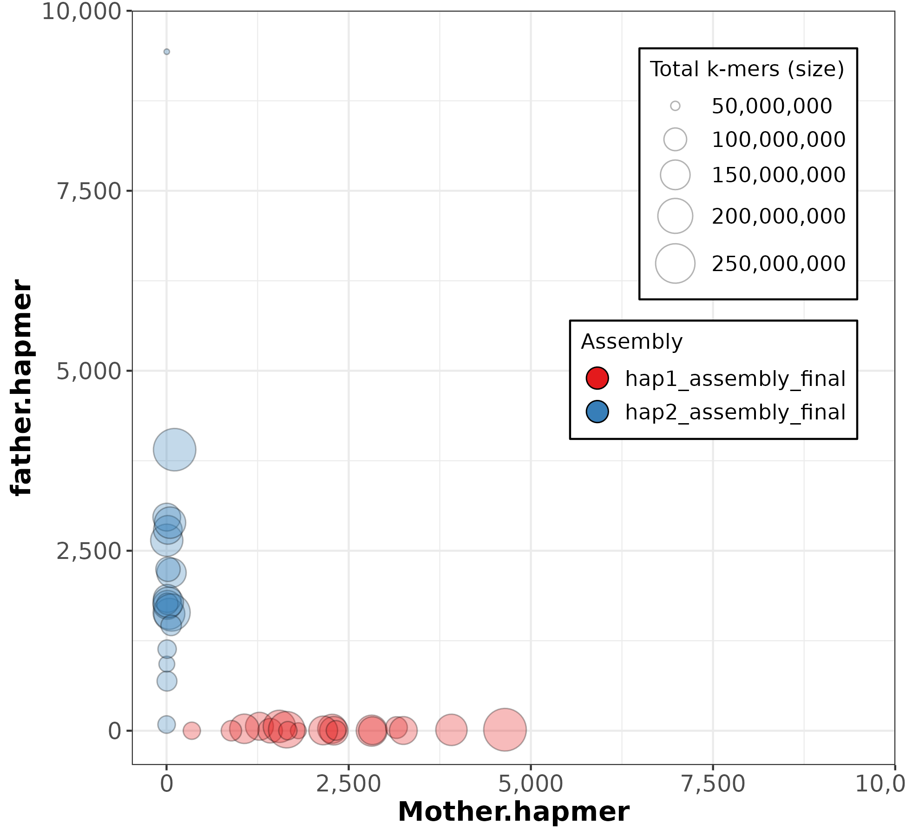

# 00.trio_binning_assembly
Use hifiasm/verkko2 generate Trio binning contigs.
## hifiasm

```bash
HiFi=all_hifi.bam.fasta
ONT=all.sup.pass.fq.gz
pat_1=paternal_1.clean.fq.gz
pat_2=paternal_2.clean.fq.gz
mat_1=maternal_1.clean.fq.gz
mat_2=maternal_2.clean.fq.gz
prefix=Sus_scrofa

yak count -b37 -t16 -o pat.yak <(cat ${pat_1} ${pat_2}) <(cat ${pat_1} ${pat_2})
yak count -b37 -t16 -o mat.yak <(cat ${mat_1} ${mat_2}) <(cat ${mat_1} ${mat_2})
# telo-m parameter must fix
hifiasm -o ${prefix} -t 50 -1 ./pat.yak -2 ./mat.yak --telo-m CCCTAA --ul ${ONT} ${HiFi} 2> out.log
awk '/^S/{print ">"$2;print $3}' ${prefix}.dip.hap1.p_ctg.gfa > ${prefix}.dip.hap1.p_ctg.fa
awk '/^S/{print ">"$2;print $3}' ${prefix}.dip.hap2.p_ctg.gfa > ${prefix}.dip.hap2.p_ctg.fa
```

## verkko2
When verkko has phasing information (like Hi-C or trio), it can generate scaffolds when the resolution is ambiguous but long range structure is clear, so it's contig maybe have gap.
https://github.com/marbl/verkko/issues/203
```bash
# generate compress kmer database
meryl count k=30 threads=24 compress output Mother.meryl maternal_*.clean.fq.gz
meryl count k=30 threads=24 compress output father.meryl paternal_*.clean.fq.gz
meryl count k=30 threads=24 compress output child.meryl Sus_scrofa_dedup.*.fq.gz
# generate hapmer.meryl
$YOUR_PATH/merqury-1.4/trio/hapmers.sh  Mother.meryl father.meryl child.meryl

HiFi=all_hifi.bam.fasta
ONT=all.sup.pass.fq.gz
# run verkko2
# telomere-motif parameter must fix
verkko -d asm \
  --hifi $HiFi \
  --nano $ONT \
  --threads 30 --telomere-motif CCCTAA --slurm \
  --hap-kmers father.hapmer.meryl \
              Mother.hapmer.meryl \
              trio

```

# 01.reads_split
Use `yak triobin` to genotype HiFi/ONT reads.

Parameter reference：https://github.com/lh3/yak/issues/1
```bash
# HiFi
## hifi.fasta.gz also can accpect
yak triobin -t 16  pat.yak mat.yak hifi.fasta > hifi_triobin.txt
awk '$3>=21&&$4<=2&&$2=="p"{print $1}' hifi_triobin.txt > hifi_paternal.txt
awk '$4>=21&&$3<=2&&$2=="m"{print $1}' hifi_triobin.txt > hifi_maternal.txt
seqkit grep -f hifi_paternal.txt hifi.fasta >hifi_pat.fa
seqkit grep -f hifi_maternal.txt hifi.fasta >hifi_mat.fa

# ONT
## fastq file also can accpect
seqkit fq2fa ONT.fq.gz > ONT.fasta
yak triobin -t 16  pat.yak mat.yak ont.fasta  > ont_triobin.txt
awk '$3>=21&&$4<=2&&$2=="p"{print $1}' ont_triobin.txt > ont_paternal.txt
awk '$4>=21&&$3<=2&&$2=="m"{print $1}' ont_triobin.txt > ont_maternal.txt
seqkit grep -f ont_paternal.txt ONT.fq.gz >ont_pat.fq
seqkit grep -f ont_maternal.txt ONT.fq.gz >ont_mat.fq
```

# 02.genotype_reads_assembly
Use genotype HiFi/ONT reads to assemble separately.
## ONT and HiFi mixture assemble
```bash
hifiasm --telo-m CCCTAA -o ul_pat -t 26 --ul ont_pat.fq hifi_pat.fq  2> out.log
hifiasm --telo-m CCCTAA -o ul_mat -t 26 --ul ont_pat.fq hifi_mat.fq  2> out.log
awk '/^S/{print ">"$2;print $3}' ul_pat.bp.p_ctg.gfa > ul_pat.bp.p_ctg.fa
awk '/^S/{print ">"$2;print $3}' ul_mat.bp.p_ctg.gfa > ul_mat.bp.p_ctg.fa
```
## ONT reads assemble separately
```bash
hifiasm --telo-m CCCTAA -o ont_pat -t 26 --ul ont_pat.fq --ont ont_pat.fq  2> out.log
hifiasm --telo-m CCCTAA -o ont_mat -t 26 --ul ont_pat.fq --ont ont_mat.fq  2> out.log
awk '/^S/{print ">"$2;print $3}' ont_pat.bp.p_ctg.gfa > ont_pat.bp.p_ctg.fa
awk '/^S/{print ">"$2;print $3}' ont_mat.bp.p_ctg.gfa > ont_mat.bp.p_ctg.fa
```

# 03.scaffloding
Use hifiasm(trio mode) contig to scaffloding.When hifiasm(trio mode) contig N50 and busco is unsatisfactory, we can ues hifiasm(Hi-C mode) contigs to scafflod.(Before scaffloding,use mummer/dotploty genotype contigs with trio contigs)

```bash
HiFi=all_hifi.bam.fasta
ONT=all.sup.pass.fq.gz
hic1=T251021_0053_3_RUN1119_1.fq.gz
hic2=T251021_0053_3_RUN1119_2.fq.gz
prefix=Sus_scrofa

# telo-m parameter must fix
hifiasm -o ${prefix} -t 50 --telo-m CCCTAA --ul ${ONT} --h1 ${hic1} --h2 ${hic2} ${HiFi} 2> out.log
awk '/^S/{print ">"$2;print $3}' ${prefix}.hic.hap1.p_ctg.gfa > ${prefix}.hic.hap1.p_ctg.fa && \
awk '/^S/{print ">"$2;print $3}' ${prefix}.hic.hap2.p_ctg.gfa > ${prefix}.hic.hap2.p_ctg.fa 

```

# 04.Gapfill and telomere expand
Using reads/contigs from the corresponding parental lines to fill gaps and extend telomeres. 

# 05.evaluation
## swith_err
```bash
yak trioeval -t16 pat.yak mat.yak hap1.fa
yak trioeval -t16 pat.yak mat.yak hap2.fa
```
## hap blob plot
```bash
# plot
$YOUR_PATH/merqury-1.4/trio/hap_blob.sh Mother.hapmer.meryl father.hapmer.meryl \
  hap1_assembly_final.fasta \
  hap2_assembly_final.fasta \
	out

```

